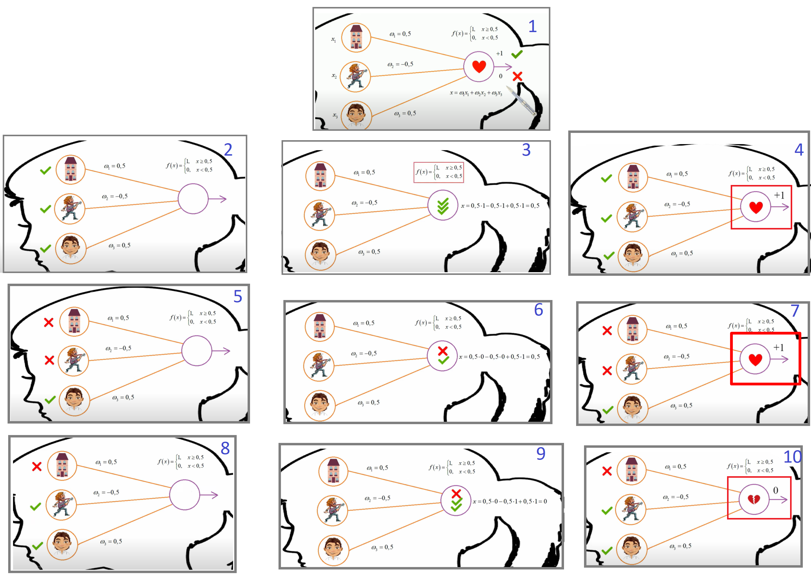
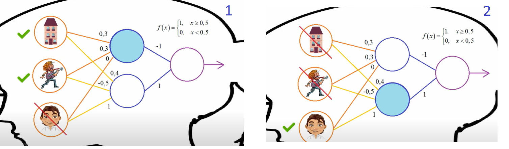

# Проект содержит различные примеры нейро сетей которые рассмотрены на портале https://proproprogs.ru/ и других ресурсах.

This document contains: 
1. List of items with names of examples files(the header), e.g. "**nlp_lesson_2_1**".
2. The name of the example in order is a specific number to be used as a reference.
3. Description - short information about an example. 
4. Source -  article URL where you can find a described example. Original information was posted by 'selfedu-rus' / Сергей Балакирев / https://www.youtube.com/c/selfedu_rus/about
5. Git - link for GIT file, if available for current example. Original information was posted by 'selfedu-rus' / Сергей Балакирев / https://www.youtube.com/c/selfedu_rus/about
6. YouTube - YouTube link where you can find a described example. Original information was posted by 'selfedu-rus' / Сергей Балакирев / https://www.youtube.com/c/selfedu_rus/about
7. Comments - any comments that can help to understand current example. Most information are related to the YouTube video and creatred article.  Original information was posted by 'selfedu-rus' / Сергей Балакирев / https://www.youtube.com/c/selfedu_rus/about

 
## nlp_lesson_2_0
**Example_2_0** 

**Description:** Пример полносвязной сети прямого распространения (Fully meshed feedforward network). 

**Source:** [selfedu-rus_article_nlp_lesson_2_1](https://proproprogs.ru/neural_network/struktura-i-princip-raboty-polnosvyaznyh-neyronnyh-setey)

**Git:** 

**YouTube:** [Пример полносвязной сеть прямого распространения (Fully meshed feedforward network)](https://www.youtube.com/watch?v=VqChpNNYZ8Q&list=PLA0M1Bcd0w8yv0XGiF1wjerjSZVSrYbjh)

**Comments:** 
* Рассмотрен классический пример полносвязной многослойной сети прямого распространения со ступенчатой активационной функцией.
* В примере реализован алгоритм определения симпатии девушки к парню если он обладает определнным набором качеств.
* На рисунке ниже приведена модель принятия решения. Рис.1 содержит описание модели персептрона у которого входным вектором являеться набор качеств парня, которые
будут анализироваться девушкой ( поведение которой как раз и будет описывать модель реализованной нейросети)
* Если сумма всех "качеств парня" (весовых коефициентов) заставят принять решение девушкой в пользу парня (функция активации = 1) то он ей подходит.
В противном случае - нет

* Рисунки 2-7 описывают модель принятия решения девушкой - ЗА, условие того что парень ей понравился.
 Рисунки 8-10 описывают модель - ПРОТИВ, когда парень не понравиться девушке. 
* Данный пример реализован без скрытых слоев, то есть это простейшая НС – персептрон.


## nlp_lesson_2_1
**Example_2_1** 

**Description:** Пример полносвязной многослойной сети прямого распространения (Fully meshed feedforward network). 

**Source:** [selfedu-rus_article_nlp_lesson_2_1](https://proproprogs.ru/neural_network/struktura-i-princip-raboty-polnosvyaznyh-neyronnyh-setey)

**Git:** [selfedu_rus_source_nlp_lesson_2_1](https://github.com/selfedu-rus/neural-network/blob/master/lesson%202_1.py)

**YouTube:** [Пример полносвязной сеть прямого распространения (Fully meshed feedforward network)](https://www.youtube.com/watch?v=VqChpNNYZ8Q&list=PLA0M1Bcd0w8yv0XGiF1wjerjSZVSrYbjh)

**Comments:** 
* Рассмотрен классический пример полносвязной многослойной сети прямого распространения со ступенчатой активационной функцией.
* В примере реализован алгоритм определения симпатии девушки к парню если он обладает определнным набором качеств.
* На рисунке ниже приведена модель принятия решения.
* Если сумма всех "качеств парня" (весовых коефициентов) заставят принять решение девушкой в пользу парня (функция активации = 1) то он ей подходит.
В противном случае - нет

* Рисунки 1,2 описывают модель принятия решения девушкой - ЗА и ПРОТИВ 


* Данный пример реализован без скрытых слоев, то есть это простейшая НС – персептрон.


## nlp_lesson_2_2
**Example: 2_2**

**Description:** Простейший персептрон для задачи классификации двух классов образов. 

**Source:** [selfedu-rus_article_nlp_lesson_2_2](https://proproprogs.ru/neural_network/perseptron-vozmozhnosti-klassifikacii-obrazov-zadacha-xor)

**Git:** [original_sourcenlp_lesson_2_2](https://github.com/selfedu-rus/neural-network/blob/master/lesson%202_2.py)

**YouTube:** [Простейший персептрон для задачи классификации двух классов образов.](https://www.youtube.com/watch?v=t9QfcFNkG58&list=PLA0M1Bcd0w8yv0XGiF1wjerjSZVSrYbjh) 

**Comments:**
* НС без скрытого слоя нейронов, с одной разделяющей гиперплоскости, без смещения.

## nlp_lesson_2_3
**Example: 2_3**

**Description:** Решение задачи XOR с одним скрытым слоем нейронов, с двумя разделяющими гиперплоскостями, со смещением.

**Source:** [selfedu-rus_article_nlp_lesson_2_3]( https://proproprogs.ru/neural_network/perseptron-vozmozhnosti-klassifikacii-obrazov-zadacha-xor)

**Git:** [selfedu_rus_source_nlp_lesson_2_3](https://github.com/selfedu-rus/neural-network/blob/master/lesson%202_3.py)

**YouTube:** 

**Comments:**  
* Простейший персептрон для задачи классификации двух классов образов.


## nlp_lesson_3
**Example 3:**

**Description:** Алгоритм обучения по методу обратного распространения (Back propagation).

**Source:** [selfedu-rus_article_nlp_lesson_3]( https://proproprogs.ru/neural_network/back-propagation-algoritm-obucheniya-po-metodu-obratnogo-rasprostraneniya)

**Git:** [selfedu_rus_source_nlp_lesson_3](https://github.com/selfedu-rus/neural-network/blob/master/lesson%203.%20Back%20propagation.py)

**YouTube:** 

**Comments:** 


## nlp_lesson_7
**Example 7:** 

**Description:** Пример использования API Keras для задачи перевода градусов Цельсия в градусы Фаренгейта. 

**Source:** [selfedu-rus_article_nlp_lesson_7]( https://proproprogs.ru/neural_network/keras-ustanovka-i-pervoe-znakomstvo)

**Git:** [selfedu_rus_source_nlp_lesson_7](https://github.com/selfedu-rus/neural-network/blob/master/lesson%207.%20keras_grads.py)

**YouTube:**  [Пример использования API Keras для задачи перевода градусов Цельсия в градусы Фаренгейта.](https://youtu.be/BQg9OZdzLLE?list=PLA0M1Bcd0w8yv0XGiF1wjerjSZVSrYbjh)

**Comments:** 
* Пример использования API Keras для задачи перевода градусов Цельсия в градусы Фаренгейта. 
* Последовательная модель нейронной сети (keras.Sequential).
* Создание полносвязного слоя нейронов (Dense).
* Линейная активационная функция: activation='linear'.
* Компиляция модели сети: model.compile().
* Запуск обучения сети: model.fit().
* Подача на вход сети данных и вычисление выходного значения: model.predict().
* Получение значений весовых коэффициентов: model.get_weights().

## nlp_lesson_14_1
**Example 14_1:** 

**Description:** CNN. Handwritten digit recognition using MNIST data.

**Source:** N/A

**Git:** [selfedu_rus_source_nlp_lesson_14_1](https://github.com/selfedu-rus/neural-network/blob/master/lesson%2014.%20CNN.py)

**YouTube:**  
1. [CNN theory_1](https://www.youtube.com/watch?v=CEUNTRdLhKk&list=PLA0M1Bcd0w8yv0XGiF1wjerjSZVSrYbjh&index=14)
2. [CNN theory_2](https://youtu.be/14wIfC7S_c0?list=PLA0M1Bcd0w8yv0XGiF1wjerjSZVSrYbjh)
3. [Implementing CNN for recognition of handwritten digit using MNIST data](https://youtu.be/14wIfC7S_c0?list=PLA0M1Bcd0w8yv0XGiF1wjerjSZVSrYbjh)

**Comments:** 
* В примере рассмотрено сверточная нейронная сеть в пакете Keras для распознавания рукописных цифр.
* Что из себя представляют сверточные нейросети, их архитектура.
* Операции свертки (сверточные слои), операции Pooling: MaxPooling, MinPooling, AveragePooling.
* Их смысл. 
* Пример архитектуры сверточной нейронной сети.

## nlp_lesson_20
**Example 20:** 

**Description:** RNN. Как рекуррентная нейронная сеть прогнозирует символы.

**Source:** N/A

**Git:** [selfedu_rus_source_nlp_lesson_20](https://github.com/selfedu-rus/neural-network/blob/master/lesson%2020.%20RNN%20chars%20prediction.py)

**YouTube:** [Characters prediction by simple RNN](https://youtu.be/8ZP6uPD91rY?list=PLA0M1Bcd0w8yv0XGiF1wjerjSZVSrYbjh)

**Comments:** 

## nlp_lesson_21_1
**Example 21_1:** 

**Description:** RNN. Как рекуррентная нейронная сеть прогнозирует слова НЕ используя Embedding слой.

**Source:** N/A

**Git:** [selfedu_rus_source_nlp_lesson_21_1](https://github.com/selfedu-rus/neural-network/blob/master/lesson%2021.%20RNN%20Embedding%20words%20predict.py)

**YouTube:**  [Words predict by RNN without Embedding layer](https://youtu.be/GIG9-d6ThNI?list=PLA0M1Bcd0w8yv0XGiF1wjerjSZVSrYbjh)

**Comments:** 
* Как можно создать сеть для прогнозирования последующих слов текста? 
* Пример реализации в пакете Keras. 
* Рассказывается о сопосбе представления слов в обучающей выборке, о парсинге текста с помощью инструмента Tokenizer, методы: fit_on_texts, texts_to_sequences, to_categorical. 
* Коллекции: word_counts, index_word. 
* Что такое Embedding слой, для чего нужен и как реализуется в Keras.

## nlp_lesson_21_2
**Example 21_2:** 

**Description:** RNN. Как рекуррентная нейронная сеть прогнозирует слова используя Embedding слой.

**Source:** [selfedu-rus_article_nlp_lesson_21_2](

**Git:** [selfedu_rus_source_nlp_lesson_21_2](https://github.com/selfedu-rus/neural-network/blob/master/lesson%2021.%20RNN%20words%20predict.py)

**YouTube:** [Words predict by RNN with Embedding layer](https://youtu.be/8ZP6uPD91rY?list=PLA0M1Bcd0w8yv0XGiF1wjerjSZVSrYbjh)

**Comments:** 
* Как можно создать сеть для прогнозирования последующих слов текста? 
* Пример реализации в пакете Keras. 
* Рассказывается о сопосбе представления слов в обучающей выборке, о парсинге текста с помощью инструмента Tokenizer, методы: fit_on_texts, texts_to_sequences, to_categorical. 
* Коллекции: word_counts, index_word. 
* Что такое Embedding слой, для чего нужен и как реализуется в Keras.


# F.A.Q.

# Project precondition
0. Check that you have installed Pyhton, PyCharm, GIT on your local machine. 
Using CMD execute next commands:
 
a)for **_Python_**:
```commandline
python
```
If you have installed it on local machine you will see version of installed python.

```commandline
PS C:\Users\userName> python
Python 3.9.5 (tags/v3.9.5:0a7dcbd, May  3 2021, 17:27:52) [MSC v.1928 64 bit (AMD64)] on win32
Type "help", "copyright", "credits" or "license" for more information.
>>>
```
If have no installed Python go to the next section and find the installation notes for the Python .

b) for **_GIT_**
```commandline
git --version
```
If you have installed it on local machine you will see version of installed GIT.
```commandline
C:\Users\userName>git --version
git version 2.32.0.windows.2
``` 

c) _**PyCharm app**_ you can check from the list of installed applications on your local machine.

1. Install **_GIT_**.

a) **_GIT_** download files are here: https://git-scm.com/downloads 

2.Install **_Python_** + **_PyCharm_**

a) Installation guide here: https://www.guru99.com/how-to-install-python.html . **Don’t miss adding Python to the PATH !!!**

Links:

1. Official Python website: https://www.python.org/downloads/
2. PyCharm installation file for Windows OS: https://www.jetbrains.com/pycharm/download/download-thanks.html?platform=windows
3. Helpfull tips
   1. GIT
      1. GIT cheat sheet:  https://education.github.com/git-cheat-sheet-education.pdf
